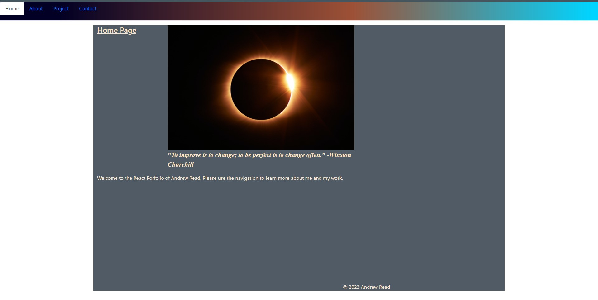
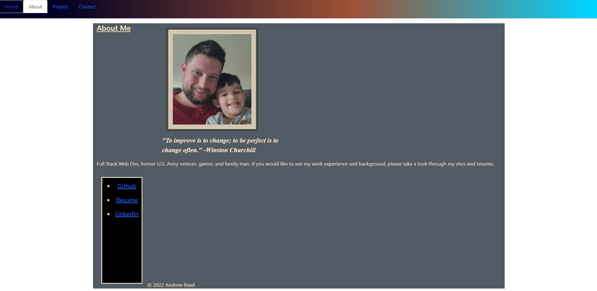
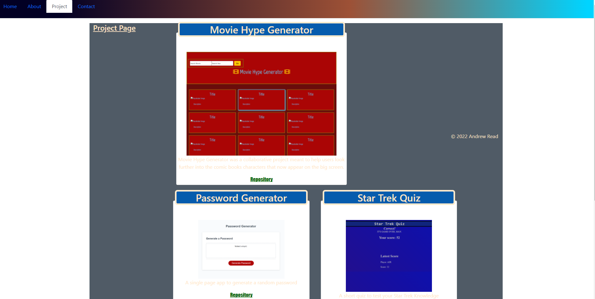
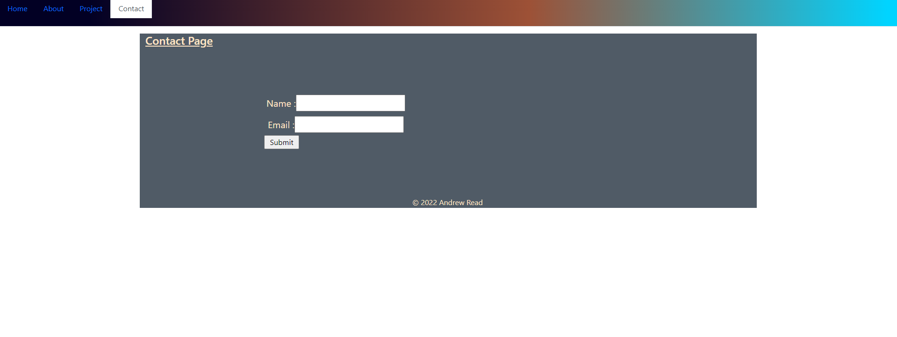

# Andrew's React Portfolio 

## Description
        - This project utilizes React in order to dynamically generate the various pages that are part of my portfolio.  This allows the user to use the nav bar to access various tabs which contain contact, projects, biography, and the home page. 
## Table of Contents
- [Installation](#installation)
- [Usage](#usage)
- [Credits](#credits)
- [License](#license) -- https://opensource.org/licenses/MIT

## Installation
        - No installation necessary, please visit the site below.
## Usage
        - This app is opened and ran in the browser.
## Screenshot

## Credits

## License
  Copyright 2021 Andrew James Read

        Permission is hereby granted, free of charge, to any person obtaining a copy of this software and associated documentation files (the "Software"), to deal in the Software without restriction, including without limitation the rights to use, copy, modify, merge, publish, distribute, sublicense, and/or sell copies of the Software, and to permit persons to whom the Software is furnished to do so, subject to the following conditions:
        
        The above copyright notice and this permission notice shall be included in all copies or substantial portions of the Software.
        
        THE SOFTWARE IS PROVIDED "AS IS", WITHOUT WARRANTY OF ANY KIND, EXPRESS OR IMPLIED, INCLUDING BUT NOT LIMITED TO THE WARRANTIES OF MERCHANTABILITY, FITNESS FOR A PARTICULAR PURPOSE AND NONINFRINGEMENT. IN NO EVENT SHALL THE AUTHORS OR COPYRIGHT HOLDERS BE LIABLE FOR ANY CLAIM, DAMAGES OR OTHER LIABILITY, WHETHER IN AN ACTION OF CONTRACT, TORT OR OTHERWISE, ARISING FROM, OUT OF OR IN CONNECTION WITH THE SOFTWARE OR THE USE OR OTHER DEALINGS IN THE SOFTWARE.
## Badges
 
## Features

## How to Contribute
        - Please contact me via email or GitHub
## Tests
        - Manually tested at milestones during live development through React.
## Questions
    - Please direct questions to andrew.read.dev@gmail.com    
    - GitHub  https://www.github.com/AJRead13 